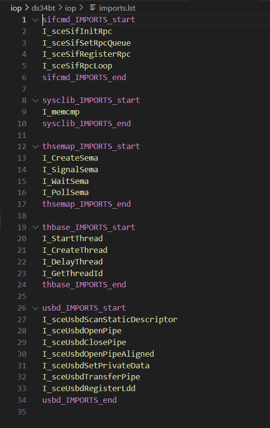

# ps2-irx-imports

sintax highlight extension for PlayStation 2 Import lists for IRX modules (mipsr3000/IOP/PS1-CPU executables)

> Tip: to complete the experience, I recommend changing the sintax highlight of `exports.tab` (if your project has one) to C

## Known Issues
You tell me ;)

**Enjoy!**
